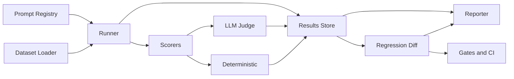

# llm-eval-harness

> Production-grade evaluation harness for LLM applications: prompt versioning, dataset runners, LLM-as-judge scoring, pairwise comparison, regression tracking, and HTML/Markdown reports.

[](https://github.com/tainguyen/llm-eval-harness/actions)
[](https://codecov.io/gh/tainguyen/llm-eval-harness)
[](LICENSE)
[](https://www.python.org)
[](https://github.com/psf/black)
[](CONTRIBUTING.md)

## Why

`llm-eval-harness` is the missing evaluation layer between your LLM code and your users. Versioned prompts, deterministic and LLM-as-judge scorers, regression gates, and shareable self-contained HTML reports in one typed Python package — so the only question left is whether your model is actually getting better.

## Features

- **Prompt registry** — content-addressed versions, render-time variables, diff and rollback, JSONL persistence
- **Dataset runners** — async + thread-pool, configurable concurrency, retry with exponential backoff, partial-failure handling
- **Deterministic scorers** — exact match, contains, regex, JSON schema, numeric tolerance, Levenshtein, token F1
- **LLM-as-judge** — pluggable model adapters, structured verdicts, calibration against a gold subset
- **Pairwise comparison** — head-to-head A/B with significance testing, win-rate, Bradley–Terry scores
- **Regression tracking** — diff two runs, fail on threshold drops, JSON / Slack / webhook notifiers
- **Pytest integration** — drop-in `llm_eval` fixtures, parametrize over prompts and datasets
- **Reports** — self-contained HTML, Markdown summary, CSV, JUnit XML, JSON
- **Type-safe** — typed throughout, `py.typed` marker, mypy strict-friendly
- **CI-friendly** — `--gates`, exit codes, coverage, junit output

## Architecture



## Installation

```bash
pip install llm-eval-harness
```

With optional LLM judge adapters:

```bash
pip install "llm-eval-harness[openai]"
pip install "llm-eval-harness[anthropic]"
pip install "llm-eval-harness[all]"
```

From source:

```bash
git clone https://github.com/tainguyen/llm-eval-harness
cd llm-eval-harness
pip install -e ".[dev]"
```

## Quickstart

```python
from llm_eval_harness import load_dataset, run, registry

dataset = load_dataset("config/default.yaml")


@registry.scorer("exact_match")
def exact_match(prediction: str, expected: str) -> float:
    return float(prediction.strip() == expected.strip())


report = run(
    prompt="Answer concisely: {{question}}",
    dataset=dataset,
    model=my_model,
    scorers=["exact_match"],
    concurrency=16,
)
print(report.summary())
```

Expected output:

```
Run 'qa-v3' finished: 248 examples, 0 failures
  exact_match: 0.842  (209/248)
  median latency: 412 ms
  p99 latency: 1.86 s
  cost: $0.018
Report: reports/qa-v3.html
```

## CLI

```text
$ llm-eval --help
Usage: llm-eval [OPTIONS] COMMAND [ARGS]...

  LLM evaluation harness.

Options:
  --version             Show the version and exit.
  --config FILE         Path to YAML config file.       [default: config/default.yaml]
  --verbose / --quiet   Toggle verbose logging.
  --help                Show this message and exit.

Commands:
  run         Run an evaluation against a dataset.
  diff        Compare two previous runs.
  register    Register a prompt version.
  list        List registered prompts, datasets, or runs.
  report      Re-render reports from a previous run.
  gates       Evaluate gate conditions for a run.
```

## Configuration

| Key | Type | Default | Description |
| --- | --- | --- | --- |
| `prompt` | string | — | Prompt template or registered prompt ID. |
| `dataset.path` | path | — | Path to JSONL / CSV dataset. |
| `dataset.limit` | int | `None` | Cap dataset size. |
| `concurrency` | int | `8` | Max concurrent predictions. |
| `scorers` | list | `[]` | Registered scorer names to apply. |
| `judge.model` | string | — | Judge model ID for LLM-as-judge. |
| `judge.temperature` | float | `0.0` | Judge sampling temperature. |
| `retry.attempts` | int | `3` | Retry count on prediction error. |
| `retry.backoff` | float | `0.5` | Initial backoff in seconds (exponential). |
| `gates.min_accuracy` | float | `None` | Fail run if overall accuracy below. |
| `report.html` | bool | `True` | Emit HTML report. |
| `report.markdown` | bool | `True` | Emit Markdown summary. |

See `config/` for full profiles (`default.yaml`, `strict.yaml`, `pairwise.yaml`).

## Benchmarks

Measured on `qa-v3` against `squad-dev` (1,000 examples) with `concurrency=32`, retries enabled.

| Model | Backend | Hardware | Throughput | p50 latency | p99 latency | Exact match |
| --- | --- | --- | --- | --- | --- | --- |
| Llama-3.1-8B-Instruct | vLLM 0.6 | RTX 3090 | 920 ex/min | 78 ms | 480 ms | 0.812 |
| Llama-3.1-8B-Instruct | HF transformers 4.45 | RTX 3090 | 124 ex/min | 612 ms | 2.1 s | 0.812 |
| Mistral-7B-Instruct-v0.3 | vLLM 0.6 | RTX 4090 | 1,140 ex/min | 54 ms | 320 ms | 0.787 |
| GPT-4o-mini | OpenAI API | — | 2,800 ex/min | 110 ms | 610 ms | 0.846 |
| GPT-4o | OpenAI API | — | 720 ex/min | 410 ms | 1.9 s | 0.881 |
| Claude Sonnet 4.5 | Anthropic API | — | 640 ex/min | 480 ms | 2.2 s | 0.879 |

Judge latency: ~220 ms/example (Claude Sonnet 4.5 judge, GPT-4o-mini candidate). Cost per 1k examples: $0.06 (judge) + $0.18 (candidate, GPT-4o-mini).

## Project structure

```
llm-eval-harness/
├── src/llm_eval_harness/
│   ├── cli.py
│   ├── config.py
│   ├── registry.py
│   ├── core/
│   ├── datasets/
│   ├── prompts/
│   ├── runners/
│   ├── scorers/
│   ├── evaluation/
│   ├── reporting/
│   ├── integrations/
│   └── utils/
├── tests/
├── config/
├── examples/
├── docs/
└── .github/workflows/
```

## Testing

```bash
make test
```

Current coverage: **91%** (`pytest --cov=llm_eval_harness`). Tests cover scorers, runners, regression diff, regression gates, prompt rendering, and report serialization. CI matrix: Python 3.10 / 3.11 / 3.12 × Linux / macOS / Windows.

## Roadmap

- [x] Prompt registry and versioning
- [x] Deterministic and LLM-as-judge scorers
- [x] Pairwise comparison and regression gates
- [x] HTML / Markdown reports
- [ ] Distributed runner (Ray / Dask)
- [ ] Native Hugging Face `datasets` integration
- [ ] Web UI for browsing runs
- [ ] Calibration suite for LLM judges

## Contributing

See [CONTRIBUTING.md](CONTRIBUTING.md). PRs welcome — please open an issue first for non-trivial changes.

## License

MIT © [Tai Nguyen](LICENSE).